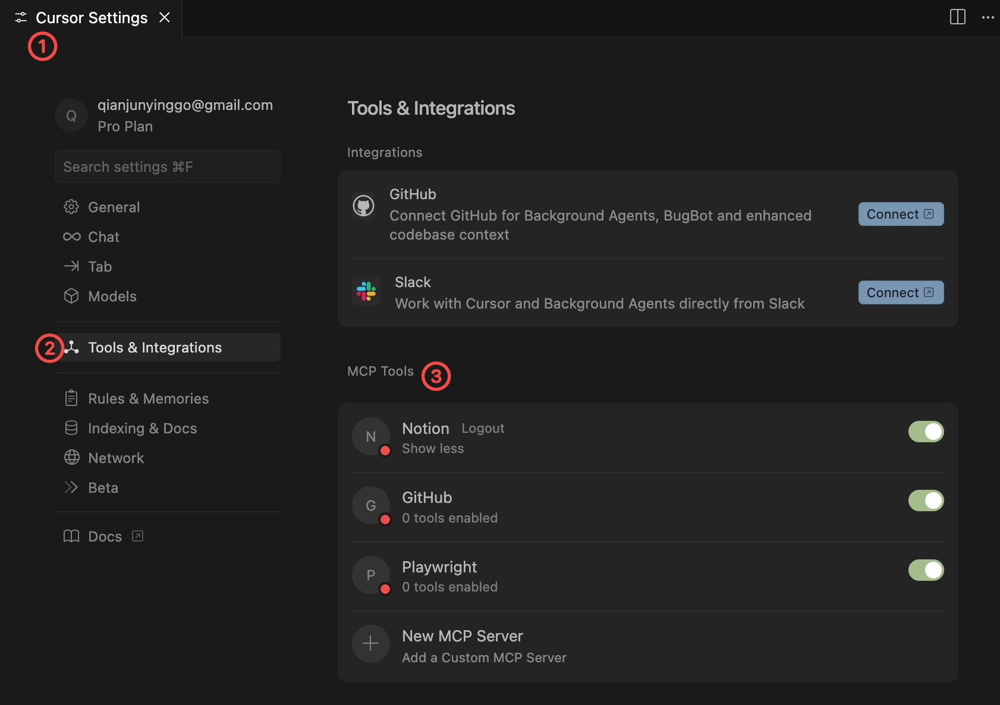

---

<GlowBackground>
  <h1 class="text-6xl md:text-8xl font-bold tracking-tight text-white">Cursor 武装升级：MCP 应用与自建</h1>
</GlowBackground>

---

# Speaker

- **钱俊颖**:
  - 社区“艺名”：Jax
  - ShareWorks 前端架构师
  - Web GDE
  - 掘金优秀创作者

---

# Agenda

1. MCP 简介
2. Cursor 中的 MCP
3. MCP Server 开发

---

# MCP 简介 —— 概念

<h3 class="flex items-center justify-center h-full">模型上下文协议（Model Context Protocol）</h3>

---

# MCP 简介 —— 用途

<h3 class="flex flex-col items-center justify-center h-full">
  <div>按照相同的格式来构成模型上下文里的 Data、Tools</div>
  <div>增强通用能力，减少信息壁垒</div>
</h3>

---

# MCP 简介 —— 生态

- https://glama.ai/mcp
- https://mcp.so/
- https://www.pulsemcp.com/

---

# MCP in Cursor —— 官方市场

<h3 class="flex flex-col items-center justify-center h-full">https://docs.cursor.com/tools/mcp</h3>

---

# MCP in Cursor —— 使用



---

# MCP Server 开发 —— 场景

- 产品经理：”给我 CMS 新增一个表单页，录入用户信息。“
- 后端开发：”接口文档写好了，放在接口平台上了。“
- 你：”喵喵喵？“

---

# MCP Server 开发 —— 效果演示

<h3 class="flex flex-col items-center justify-center h-full">Todo: screenshot.gif</h3>

---

# MCP Server 开发 —— 核心代码 —— 依赖库

<div class="flex flex-col items-start justify-center h-full">
  <div>import { McpServer, ResourceTemplate } from "@modelcontextprotocol/sdk/server/mcp.js";</div>
  <div>import { StdioServerTransport } from "@modelcontextprotocol/sdk/server/stdio.js";</div>
  <div>import { z } from "zod";</div>
</div>

---

# MCP Server 开发 —— 核心代码 —— 创建 & 注册

<div class="flex flex-col items-start justify-center h-full">
  <div>const server = new McpServer({
  name: 'Torna',
  version: '1.0.0'
})</div>
  <div>server.tool(
  'torna',
  { docId: z.string() },
  dataFunction
  )</div>
</div>

---

# MCP Server 开发 —— 核心代码 —— 获取数据

<div class="flex flex-col items-start justify-center h-full">
  ```const dataFunction = async ({ docId }) => {
    const response = await fetch(
      `https://api.torna.io/api/v1/docs/${docId}`,
      {
        headers: { Authorization: 'Bearer ...' }
      }
    )
    const data = await response.json()
    return {
      content: [
        {
          type: 'text',
          text: `API URL: ${data.projectName}/${data.url}`
        },
        {
          type: 'text',
          text: `API method: ${data.httpMethod}`
        },
        {
          type: 'text',
          text: `API request parameters: ${JSON.stringify(data.params)}`
        }
      ]
    }
  }`
</div>

---

# MCP Server 开发 —— 核心代码 —— 连接

<div class="flex flex-col items-start justify-center h-full">
  <div>const transport = new StdioServerTransport();</div>
  <div>server.connect(transport);</div>
</div>
---

# MCP Server 开发 —— 安装

<h3 class="flex flex-col items-center justify-center h-full">在 Cursor mcp.json 中增加配置项</h3>

---

<GlowBackground>
  <h1 class="text-6xl md:text-8xl font-bold tracking-tight text-white">感谢倾听!</h1>
</GlowBackground>
