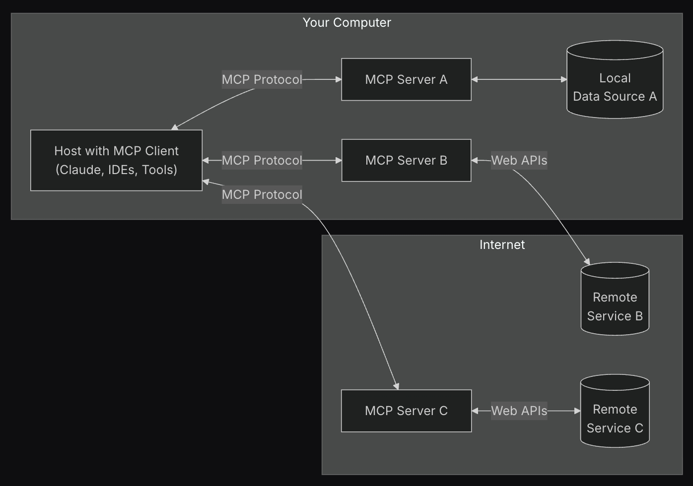
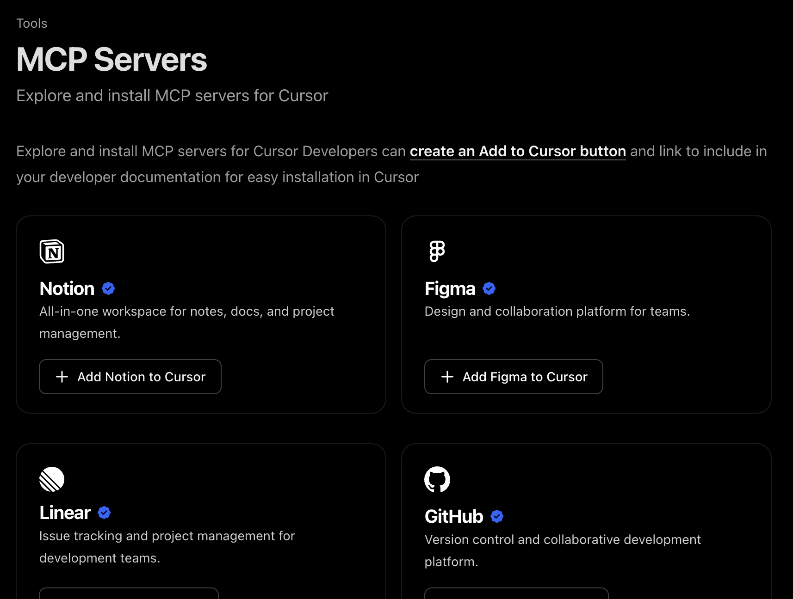
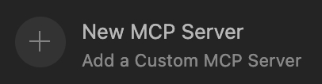
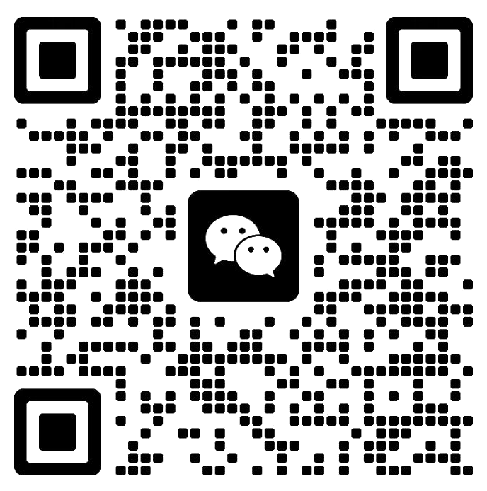

<GlowBackground>
  <div class="flex flex-col items-center justify-center h-full">
                <h1 class="tracking-tight text-white" style="text-shadow: 0 4px 0 rgba(0,0,0,0.3), 0 8px 8px rgba(0,0,0,0.2); transform: perspective(800px) rotateX(8deg) translateZ(0); margin-bottom: 0px;">Cursor 🚀 武装升级</h1>
      <div class="h-px bg-gradient-to-r from-transparent via-[#40e0d0]/40 to-transparent w-32 mx-auto my-6"></div>
      <h2 class="tracking-tight text-white" style=""><span class="bg-gradient-to-r from-[#00ffff] via-[#00bfff] to-[#00ff99] bg-clip-text text-transparent font-extrabold animate-pulse">MCP</span> <span class="font-light">应用 & 自建</span></h2>
  </div>
</GlowBackground>

---

<div class="overline text-[14px] font-medium tracking-wider uppercase text-white/80 mb-2">Speaker</div>
<div class="flex flex-col items-center justify-center mt-16 space-y-8">
  <div class="relative">
    <div class="absolute -inset-4 bg-gradient-to-r from-[#40e0d0]/20 to-[#40e0d0]/10 rounded-2xl blur-xl"></div>
    <div class="relative bg-[#171717] border border-[#252525] rounded-2xl p-8 backdrop-blur-sm">
      <div class="text-center space-y-4 flex items-center">
        <div class="space-y-2 text-right">
          <h1 class="text-5xl font-bold text-white tracking-tight">钱俊颖</h1>
          <h2 class="text-2xl font-medium text-[#40e0d0]">Jax</h2>
        </div>
                 <div class="w-px bg-gradient-to-b from-transparent via-[#40e0d0]/30 to-transparent h-36 mx-10"></div>
        <div class="text-white/80">
          <div class="flex items-center justify-start text-2xl">
            <span class="">🏗️</span>
            <span class="">ShareWorks 前端架构师</span>
          </div>
          <div class="flex items-center justify-start text-2xl my-10">
            <span class="">🏅</span>
            <span class="">Web GDE</span>
          </div>
          <div class="flex items-center justify-start text-2xl">
            <span class="">✍️</span>
            <span class="">掘金优秀创作者</span>
          </div>
        </div>
      </div>
    </div>
  </div>
</div>

---

<div class="overline text-[14px] font-medium tracking-wider uppercase text-white/80 mb-2">Agenda</div>
<div class="p-6 max-w-xl mx-auto mt-10">
  <ol class="text-left text-white/80 list-decimal list-inside text-3xl font-semibold">
    <li class="mb-2">MCP 简介</li>
    <li class="mb-2">Cursor 中的 MCP</li>
    <li class="mb-2">MCP Server 开发</li>
  </ol>
</div>

---

<div class="overline text-[14px] font-medium tracking-wider uppercase text-white/80 mb-2">MCP 简介 - 概念</div>
<h1 class="flex items-center justify-center font-semibold text-white/80 mt-35">模型<span class="text-[#40e0d0]">上下文</span>协议</h1>
<h3 class="flex items-center justify-center font-semibold text-white/80 mt-2 mb-5">Model Context Protocol</h3>
<div class="flex items-center justify-center font-semibold text-white/50 mt-2">约定统一的格式，来构成模型上下文里的 Data、Tools</div>
<div class="flex items-center justify-center font-semibold text-white/50 mt-2">增强通用能力，减少信息壁垒</div>

---

<div class="overline text-[14px] font-medium tracking-wider uppercase text-white/80 mb-2">MCP 简介 - 用途</div>


---

<div class="overline text-[14px] font-medium tracking-wider uppercase text-white/80 mb-2">MCP 简介 - 生态</div>
  <div class="flex flex-col items-center justify-center mt-15 mb-10">
    <div class="text-[72px] font-semibold bg-gradient-to-r from-[#40e0d0] to-white bg-clip-text text-transparent">6800+</div>
    <div class="text-[24px] font-semibold text-white/50">MCP servers</div>
  </div>
  <div class="flex items-center justify-center">
    <div class="card bg-[#171717] border border-[#252525] rounded-l-[4px] p-6 max-w-xl">
      <a href="https://glama.ai/mcp" target="_blank" class="underline">Glama</a>
    </div>
    <div class="card bg-[#171717] border border-[#252525] p-6 max-w-xl">
      <a href="https://mcp.so/" target="_blank" class="underline">MCP.so</a>
    </div>
    <div class="card bg-[#171717] border border-[#252525] rounded-r-[4px] p-6 max-w-xl">
      <a href="https://www.pulsemcp.com/" target="_blank" class="underline">PulseMCP</a>
    </div>
  </div>

---

<div class="overline text-[14px] font-medium tracking-wider uppercase text-white/80 mb-2">MCP in Cursor - 官方市场</div>
<h3 class="flex flex-col items-center justify-center font-semibold text-white/80"><a href="https://docs.cursor.com/tools/mcp" target="_blank" class="underline my-10">https://docs.cursor.com/tools/mcp</a></h3>


---

<div class="overline text-[14px] font-medium tracking-wider uppercase text-white/80 mb-2">MCP in Cursor - 使用</div>
  

---

<div class="overline text-[14px] font-medium tracking-wider uppercase text-white/80 mb-2">MCP Server 开发 - 场景</div>
<div class="card bg-[#171717] border border-[#252525] rounded-[4px] p-6 max-w-xl mx-auto mt-10 flex flex-col space-y-4">
  <div class="self-start max-w-[75%] bg-[#252525]/50 rounded-lg p-3">
    <div class="text-xs text-white/60 mb-1">产品经理</div>
    <p class="text-white/80">”给我 CMS 新增一个表单页，录入用户信息。“</p>
  </div>
  <div class="self-start max-w-[75%] bg-[#252525]/50 rounded-lg p-3">
    <div class="text-xs text-white/60 mb-1">后端开发</div>
    <p class="text-white/80">”接口文档写好了，放在接口平台上了。“</p>
  </div>
  <div class="self-end max-w-[75%] bg-[#40e0d0]/20 rounded-lg p-3">
    <div class="text-xs text-white/60 mb-1 text-right">你</div>
    <p class="text-white/80 text-right">”喵喵喵？“</p>
  </div>
</div>

---

<div class="overline text-[14px] font-medium tracking-wider uppercase text-white/80 mb-2">MCP Server 开发 - 效果</div>
<div class="max-w-6xl mx-auto mt-10">
  <div class="flex items-center justify-center">
    <div class="flex flex-col items-center space-y-2">
      <div class="flex items-center space-x-4">
        <div class="relative">
          <svg width="200" height="100" viewBox="0 0 200 100" class="text-white/80">
            <path d="M20 30 Q20 20 30 20 L170 20 Q180 20 180 30 L180 65 Q180 75 170 75 L50 75 L20 60 Z" fill="currentColor" opacity="0.9"/>
          </svg>
          <div class="absolute inset-0 flex items-center justify-center text-sm text-black font-medium leading-tight px-8">
            "按照接口文档的<br/>格式生成表单页"
          </div>
        </div>
      </div>
      <div class="text-4xl text-[#40e0d0] animate-pulse">+</div>
      <div class="flex items-center space-x-4">
        
      </div>
      <div class="text-4xl text-[#40e0d0] animate-pulse">+</div>
        <div class="flex items-center space-x-4">
          <svg width="128" height="128" viewBox="0 0 64 64" class="text-[#40e0d0]">
            <rect x="8" y="16" width="48" height="32" rx="4" fill="none" stroke="currentColor" stroke-width="2"/>
            <rect x="8" y="16" width="48" height="32" rx="4" fill="currentColor" fill-opacity="0.1"/>
            <circle cx="16" cy="24" r="2" fill="currentColor"/>
            <circle cx="24" cy="24" r="2" fill="currentColor"/>
            <circle cx="32" cy="24" r="2" fill="currentColor"/>
            <path d="M12 40 L52 40" stroke="currentColor" stroke-width="2"/>
            <path d="M16 44 L48 44" stroke="currentColor" stroke-width="2"/>
            <text x="32" y="35" text-anchor="middle" fill="currentColor" font-size="4" font-weight="600">MCP</text>
            <rect x="40" y="20" width="12" height="3" rx="1.5" fill="currentColor" fill-opacity="0.6"/>
            <rect x="40" y="26" width="8" height="3" rx="1.5" fill="currentColor" fill-opacity="0.4"/>
          </svg>
        </div>
    </div>
    <div class="flex flex-col items-center mx-12">
      <div class="relative">
        <svg width="80" height="20" viewBox="0 0 80 20" class="text-[#40e0d0]">
          <path d="M5 10 L65 10 M60 5 L65 10 L60 15" stroke="currentColor" stroke-width="2" fill="none"/>
        </svg>
      </div>
    </div>
    <div class="flex flex-col items-center space-y-4">
              <div class="relative">
          <div class="w-32 h-40 rounded-lg bg-gradient-to-br from-[#40e0d0]/20 to-[#40e0d0]/10 border border-[#40e0d0]/30 p-5 shadow-lg shadow-[#40e0d0]/20">
          <div class="space-y-2">
            <div class="h-2 bg-[#40e0d0]/40 rounded w-full"></div>
            <div class="h-1 bg-white/30 rounded w-3/4"></div>
            <div class="h-1 bg-white/30 rounded w-1/2"></div>
            <div class="h-2 bg-[#40e0d0]/40 rounded w-full"></div>
            <div class="h-1 bg-white/30 rounded w-2/3"></div>
            <div class="h-2 bg-[#40e0d0]/40 rounded w-full"></div>
            <div class="h-1 bg-white/30 rounded w-4/5"></div>
            <div class="h-3 bg-[#40e0d0]/60 rounded w-1/2 mt-3"></div>
          </div>
        </div>
        <div class="absolute -inset-1 bg-gradient-to-r from-[#40e0d0]/20 to-[#40e0d0]/10 rounded-lg blur-md -z-10 animate-pulse"></div>
      </div>
      <div class="text-white/60 text-sm">✨ CMS Form</div>
    </div>
  </div>
</div>

---

<div class="overline text-[14px] font-medium tracking-wider uppercase text-white/80 mb-2">MCP Server 开发 - 核心代码</div>
<div class="mt-10">

<style>
.slidev-layout pre {
  font-size: 0.96rem !important;
  line-height: 1.4 !important;
}
</style>

  ```js
  // mcp-servers/api-doc.js
  import { McpServer } from "@modelcontextprotocol/sdk/server/mcp.js";
  import { StdioServerTransport } from "@modelcontextprotocol/sdk/server/stdio.js";
  import { z } from "zod";
  import { fetchDataFunc } from './fetchData.js'

  const server = new McpServer({
    name: 'ApiDoc',
    version: '1.0.0'
  })

  server.registerTool('api_doc',
    { inputSchema: {
        docId: z.string().describe('API document ID, uses "docId" as the key')
    }},
    fetchDataFunc
  )

  const transport = new StdioServerTransport()
  await server.connect(transport)
  ```

</div>

---

<div class="overline text-[14px] font-medium tracking-wider uppercase text-white/80 mb-2">MCP Server 开发 - 核心代码</div>
<div class="mt-10">

<style>
.slidev-layout pre {
  font-size: 0.96rem !important;
  line-height: 1.4 !important;
}
</style>

  ```js
  // fetchData.js
  export async function fetchDataFunc ({ docId }) {
      const response = await fetch(
        `https://example.com/api/endpoints/${docId}`,
      )
      const data = await response.json()
      const { method, path, properties } = data || {}
      return {
        content: [
          { type: 'text', text: `API name: ${docId}` },
          { type: 'text', text: `API URL: ${path}` },
          { type: 'text', text: `API method: ${method}` },
          { type: 'text', text: `API request parameters: ${JSON.stringify(properties)}` }
        ]
      }
  }
  ```

</div>

---

<div class="overline text-[14px] font-medium tracking-wider uppercase text-white/80 mb-2">MCP Server 开发 - 安装</div>
<div class="flex items-center justify-center mt-14">
  <div class="flex justify-end">
    
  </div>
  <div class="text-2xl text-[#40e0d0] animate-pulse mx-5">➡️</div>
<div class="">

<style>
.slidev-layout pre {
  font-size: 1.2rem !important;
  line-height: 1.6 !important;
}
</style>

  ```json
  // ~/.cursor/mcp.json
  {
    // other configs ...
    "mcpServers": {
      "ApiDoc": {
        "command": "node",
        "args": [
          "/path/to/mcp-servers/api-doc.js"
        ],
      }
    }
  }
  ```

</div>
</div>

---

<GlowBackground>
  <div class="flex items-center justify-center h-full">
    <div class="">
      <h1 class="text-6xl md:text-8xl font-extrabold tracking-tight text-white mb-14">感谢倾听</h1>
      <h1 class="text-6xl md:text-8xl font-extrabold tracking-tight text-white">欢迎交流</h1>
    </div>
    <div class="text-4xl md:text-6xl font-extrabold tracking-tight text-white mx-10">💬</div>
    
  </div>

</GlowBackground>
