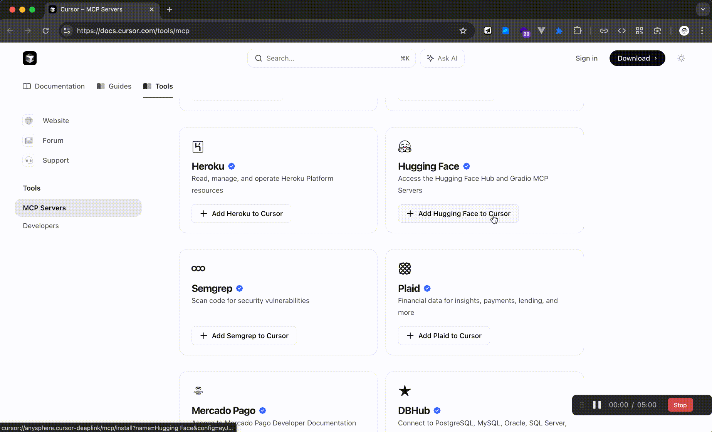
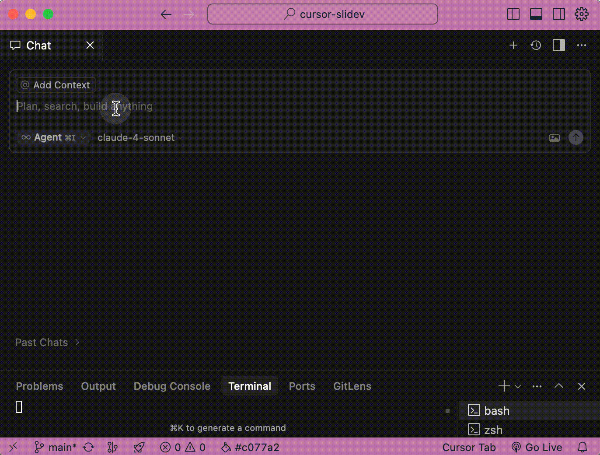
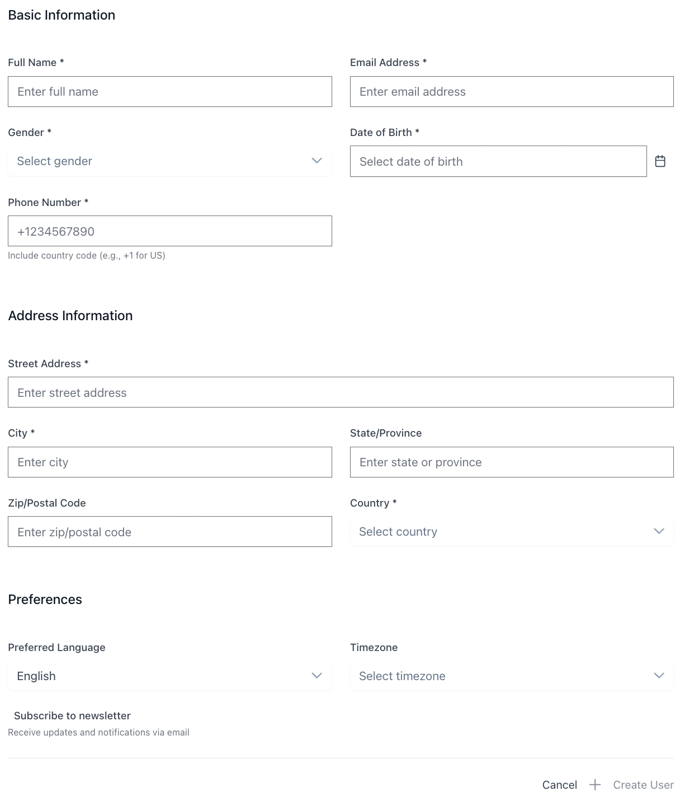
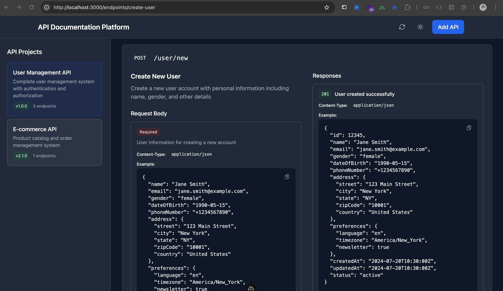
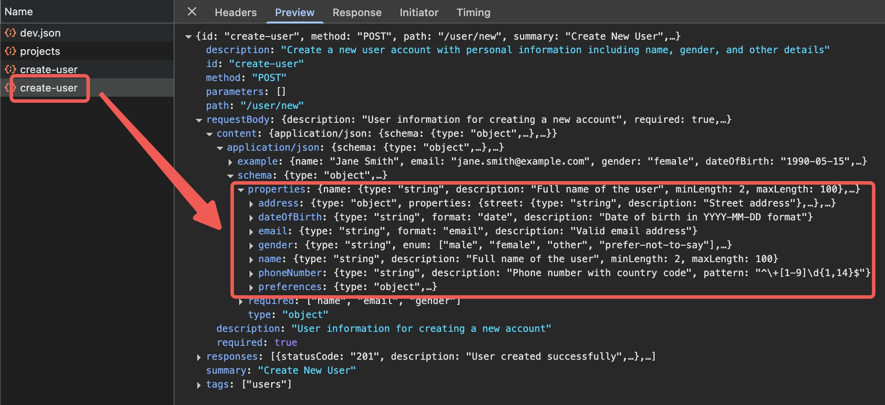
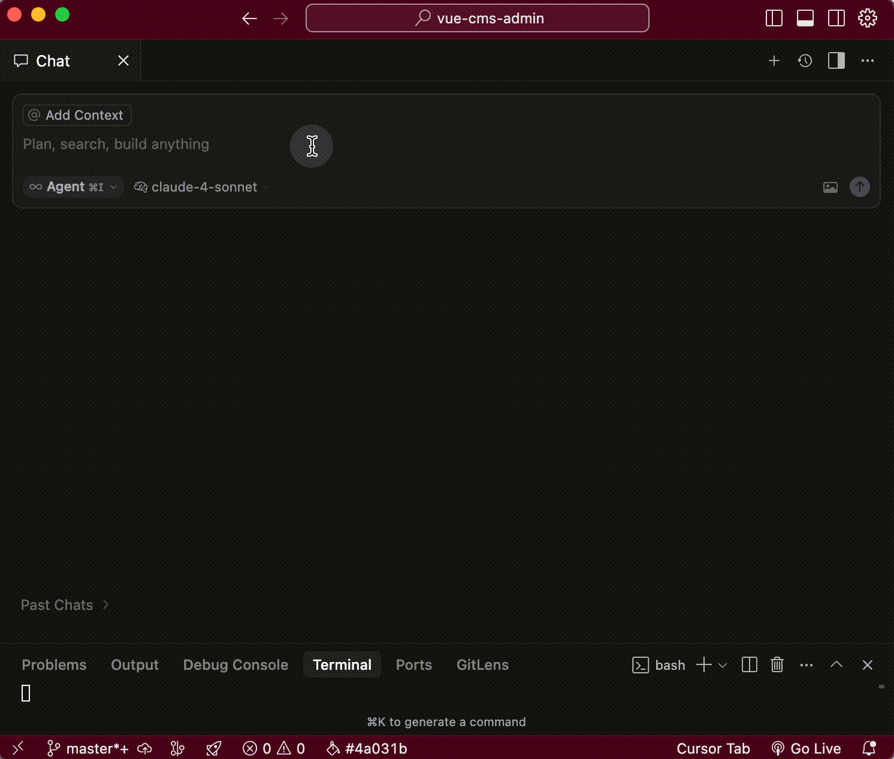
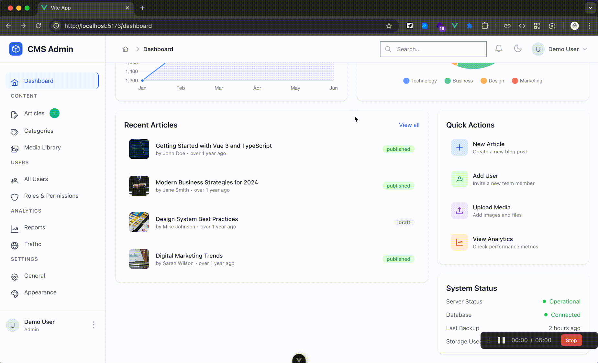

<GlowBackground>
  <div class="flex flex-col items-center justify-center h-full">
                <h1 class="tracking-tight text-white" style="text-shadow: 0 4px 0 rgba(0,0,0,0.3), 0 8px 8px rgba(0,0,0,0.2); transform: perspective(800px) rotateX(8deg) translateZ(0); margin-bottom: 0px;">Cursor 🚀 武装升级</h1>
      <div class="h-px bg-gradient-to-r from-transparent via-[#40e0d0]/40 to-transparent w-32 mx-auto my-6"></div>
      <h2 class="tracking-tight text-white" style=""><span class="bg-gradient-to-r from-[#00ffff] via-[#00bfff] to-[#00ff99] bg-clip-text text-transparent font-extrabold animate-pulse">MCP</span> <span class="font-light">应用 & 自建</span></h2>
  </div>
</GlowBackground>

---

<div class="overline text-[14px] font-medium tracking-wider uppercase text-white/80 mb-2">Speaker</div>
<div class="flex flex-col items-center justify-center mt-16 space-y-8">
  <div class="relative">
    <div class="absolute -inset-4 bg-gradient-to-r from-[#40e0d0]/20 to-[#40e0d0]/10 rounded-2xl blur-xl"></div>
    <div class="relative bg-[#171717] border border-[#252525] rounded-2xl p-8 backdrop-blur-sm">
      <div class="text-center space-y-4 flex items-center">
        <div class="space-y-2 text-right">
          <h1 class="text-5xl font-bold text-white tracking-tight">钱俊颖</h1>
          <h2 class="text-2xl font-medium text-[#40e0d0]">Jax</h2>
        </div>
                 <div class="w-px bg-gradient-to-b from-transparent via-[#40e0d0]/30 to-transparent h-36 mx-10"></div>
        <div class="text-white/80">
          <div class="flex items-center justify-start text-2xl">
            <span class="mr-2">🏗️</span>
            <span class="">ShareWorks 前端架构师</span>
          </div>
          <div class="flex items-center justify-start text-2xl my-6">
            <span class="mr-2">🏅</span>
            <span class="">Web GDE</span>
          </div>
          <div class="flex items-center justify-start text-2xl">
            <span class="mr-2">✍️</span>
            <span class="">掘金优秀创作者</span>
          </div>
        </div>
      </div>
    </div>
  </div>
</div>

---

<div class="overline text-[14px] font-medium tracking-wider uppercase text-white/80 mb-2">Agenda</div>
<div class="p-6 max-w-xl mx-auto mt-10">
  <ol class="text-left text-white/80 list-decimal list-inside text-3xl font-semibold">
    <li class="mb-2">MCP 简介</li>
    <li class="mb-2">Cursor 中的 MCP</li>
    <li class="mb-2">MCP Server 开发</li>
  </ol>
</div>

---

<div class="overline text-[14px] font-medium tracking-wider uppercase text-white/80 mb-2">MCP 简介 - 概念</div>
<h1 class="flex items-center justify-center font-semibold text-white/80 mt-35">模型<span class="text-[#40e0d0]">上下文</span>协议</h1>
<h3 class="flex items-center justify-center font-semibold text-white/80 mt-2 mb-5">Model Context Protocol</h3>
<div class="flex items-center justify-center font-semibold text-white/50 mt-2">用统一的格式</div>
<div class="flex items-center justify-center font-semibold text-white/50 mt-2">构成更高效、更准确的上下文</div>

---

<div class="overline text-[14px] font-medium tracking-wider uppercase text-white/80 mb-2">MCP 简介 - 用途</div>

<div class="flex items-center justify-center font-semibold text-white/50 mt-4 text-[14px]">图片来源：<a href="https://modelcontextprotocol.io/introduction" target="_blank" class="underline text-white/50">https://modelcontextprotocol.io/introduction</a></div>

---

<div class="overline text-[14px] font-medium tracking-wider uppercase text-white/80 mb-2">MCP 简介 - 生态</div>
  <div class="flex flex-col items-center justify-center mt-15 mb-10">
    <div class="text-[72px] font-semibold bg-gradient-to-r from-[#40e0d0] to-white bg-clip-text text-transparent">6800+</div>
    <div class="text-[24px] font-semibold text-white/50">MCP servers</div>
  </div>
  <div class="flex items-center justify-center">
    <div class="card bg-[#171717] border border-[#252525] rounded-l-[4px] p-6 max-w-xl">
      <a href="https://glama.ai/mcp" target="_blank" class="underline">Glama</a>
    </div>
    <div class="card bg-[#171717] border border-[#252525] p-6 max-w-xl">
      <a href="https://mcp.so/" target="_blank" class="underline">MCP.so</a>
    </div>
    <div class="card bg-[#171717] border border-[#252525] rounded-r-[4px] p-6 max-w-xl">
      <a href="https://www.pulsemcp.com/" target="_blank" class="underline">PulseMCP</a>
    </div>
  </div>

---

<div class="overline text-[14px] font-medium tracking-wider uppercase text-white/80 mb-2">MCP in Cursor - 官方市场</div>
<h3 class="flex flex-col items-center justify-center font-semibold text-white/80"><a href="https://docs.cursor.com/tools/mcp" target="_blank" class="underline my-10">https://docs.cursor.com/tools/mcp</a></h3>


---

<div class="overline text-[14px] font-medium tracking-wider uppercase text-white/80 mb-2">MCP in Cursor - 一键安装</div>

<div class="flex items-center justify-center font-semibold text-white/50 mt-4 text-[14px]">从<a href="https://docs.cursor.com/tools/mcp" target="_blank" class="underline text-white/50">官方工具市场</a>一键装入 Cursor</div>

---

<div class="overline text-[14px] font-medium tracking-wider uppercase text-white/80 mb-2">MCP in Cursor - 手动维护</div>
  

---

<div class="overline text-[14px] font-medium tracking-wider uppercase text-white/80 mb-2">MCP in Cursor - 手动维护</div>
  

---

<div class="overline text-[14px] font-medium tracking-wider uppercase text-white/80 mb-2">MCP in Cursor - 使用</div>
  
<div class="flex items-center justify-center font-semibold text-white/50 mt-4 text-[14px]">自动匹配合适的 MCP tool</div>

---

<div class="overline text-[14px] font-medium tracking-wider uppercase text-white/80 mb-2">MCP Server 开发 - 场景</div>
<div class="card bg-[#171717] border border-[#252525] rounded-[4px] p-6 max-w-xl mx-auto mt-10 flex flex-col space-y-4">
  <div class="self-start max-w-[75%] bg-[#252525]/50 rounded-lg p-3">
    <div class="text-xs text-[#40e0d0] mb-1">产品经理</div>
    <p class="text-white/80">”在 CMS 里做个表单页，用来录入用户信息。“</p>
  </div>
  <div class="self-start max-w-[75%] bg-[#252525]/50 rounded-lg p-3">
    <div class="text-xs text-[#40e0d0] mb-1">后端开发</div>
    <p class="text-white/80">”接口文档写好了，放在接口平台上了。“</p>
  </div>

  <div class="mt-4 bg-[#1a1a1a] border-t border-[#333] p-4">
    <div class="flex items-center space-x-3 max-w-[100%] ml-auto">
      <div class="flex-1 relative">
        <input type="text" 
               value="我只想早点下班。。。" 
               class="w-full bg-[#2d2d2d] border border-[#404040] rounded-full px-4 py-3 text-white/90 text-sm outline-none focus:border-[#40e0d0]/50 focus:ring-1 focus:ring-[#40e0d0]/30" 
               placeholder="输入消息..." 
               readonly />
        <div class="absolute left-40 top-1/2 transform -translate-y-1/2 w-px h-4 bg-white/60 animate-pulse"></div>
      </div>
      <button class="bg-[#40e0d0] hover:bg-[#40e0d0]/80 rounded-full p-3 transition-colors duration-200 flex items-center justify-center">
        <svg width="16" height="16" viewBox="0 0 24 24" fill="none" class="text-black">
          <path d="M2 21L23 12L2 3V10L17 12L2 14V21Z" fill="currentColor"/>
        </svg>
      </button>
    </div>
  </div>
</div>

---

<div class="overline text-[14px] font-medium tracking-wider uppercase text-white/80 mb-2">MCP Server 开发 - 场景</div>

<div class="flex items-center justify-center font-semibold text-white/50 mt-4 text-[14px]">产品经理想要的管理后台表单页</div>

---

<div class="overline text-[14px] font-medium tracking-wider uppercase text-white/80 mb-2">MCP Server 开发 - 场景</div>
<div class="flex items-center justify-center gap-10 mt-20">
  <div class="flex flex-col items-center justify-center flex-1">
    
    <div class="flex items-center justify-center font-semibold text-white/50 mt-4 text-[14px]">接口文档平台长这样</div>
  </div>
  <div class="flex flex-col items-center justify-center flex-1">
    
    <div class="flex items-center justify-center font-semibold text-white/50 mt-4 text-[14px]">文档数据来自 HTTP 请求</div>
  </div>
</div>

---

<div class="overline text-[14px] font-medium tracking-wider uppercase text-white/80 mb-2">MCP Server 开发 - 原始模式</div>
<div class="max-w-6xl mx-auto mt-24">
  <div class="flex items-center justify-center space-x-8">
    <!-- Step 1: Create Routes & APIs -->
    <div class="relative w-[25%]">
      <div class="bg-gradient-to-br from-slate-700/50 to-slate-800/50 border border-slate-600/30 rounded-lg p-6 backdrop-blur-sm">
        <div class="flex items-center justify-center w-12 h-12 bg-red-500/20 rounded-full border border-red-500/30 mb-4 mx-auto">
          <svg class="w-6 h-6 text-red-400" fill="none" stroke="currentColor" viewBox="0 0 24 24">
            <path stroke-linecap="round" stroke-linejoin="round" stroke-width="2" d="M10 20l4-16m4 4l4 4-4 4M6 16l-4-4 4-4"/>
          </svg>
        </div>
        <h5 class="text-white font-semibold text-center mb-2 text-white/60">新建页面路由<br/>& API 方法</h5>
      </div>
      <div class="absolute -right-7 top-1/2 transform -translate-y-1/2 text-[#40e0d0] text-2xl z-10">→</div>
    </div>
    <!-- Step 2: Build Components -->
    <div class="relative w-[25%]">
      <div class="bg-gradient-to-br from-slate-700/50 to-slate-800/50 border border-slate-600/30 rounded-lg p-6 backdrop-blur-sm">
        <div class="flex items-center justify-center w-12 h-12 bg-orange-500/20 rounded-full border border-orange-500/30 mb-4 mx-auto">
          <svg class="w-6 h-6 text-orange-400" fill="none" stroke="currentColor" viewBox="0 0 24 24">
            <path stroke-linecap="round" stroke-linejoin="round" stroke-width="2" d="M19 11H5m14 0a2 2 0 012 2v6a2 2 0 01-2 2H5a2 2 0 01-2-2v-6a2 2 0 012-2m14 0V9a2 2 0 00-2-2M5 11V9a2 2 0 012-2m0 0V5a2 2 0 012-2h6a2 2 0 012 2v2M7 7h10"/>
          </svg>
        </div>
        <h5 class="text-white font-semibold text-center mb-2 text-white/60">逐个堆叠<br />表单组件</h5>
      </div>
      <div class="absolute -right-7 top-1/2 transform -translate-y-1/2 text-[#40e0d0] text-2xl z-10">→</div>
    </div>
    <!-- Step 3: Data Alignment -->
    <div class="flex-1 relative w-[25%]">
      <div class="bg-gradient-to-br from-slate-700/50 to-slate-800/50 border border-slate-600/30 rounded-lg p-6 backdrop-blur-sm">
        <div class="flex items-center justify-center w-12 h-12 bg-yellow-500/20 rounded-full border border-yellow-500/30 mb-4 mx-auto">
          <svg class="w-6 h-6 text-yellow-400" fill="none" stroke="currentColor" viewBox="0 0 24 24">
            <path stroke-linecap="round" stroke-linejoin="round" stroke-width="2" d="M9 12h6m-6 4h6m2 5H7a2 2 0 01-2-2V5a2 2 0 012-2h5.586a1 1 0 01.707.293l5.414 5.414a1 1 0 01.293.707V19a2 2 0 01-2 2z"/>
          </svg>
        </div>
        <h5 class="text-white font-semibold text-center mb-2 text-white/60">匹配数据格式<br />与 API 文档</h5>
      </div>
      <div class="absolute -right-7 top-1/2 transform -translate-y-1/2 text-[#40e0d0] text-2xl z-10">→</div>
    </div>
    <!-- Step 4: Integration Testing -->
    <div class="flex-1 w-[25%]">
      <div class="bg-gradient-to-br from-slate-700/50 to-slate-800/50 border border-slate-600/30 rounded-lg p-6 backdrop-blur-sm">
        <div class="flex items-center justify-center w-12 h-12 bg-blue-500/20 rounded-full border border-blue-500/30 mb-4 mx-auto">
          <svg class="w-6 h-6 text-blue-400" fill="none" stroke="currentColor" viewBox="0 0 24 24">
            <path stroke-linecap="round" stroke-linejoin="round" stroke-width="2" d="M8.111 16.404a5.5 5.5 0 017.778 0M12 20h.01m-7.08-7.071c3.904-3.905 10.236-3.905 14.141 0M1.394 9.393c5.857-5.857 15.355-5.857 21.213 0"/>
          </svg>
        </div>
        <h5 class="text-white font-semibold text-center mb-2 text-white/60">前后端<br />联调</h5>
      </div>
    </div>
  </div>
  <!-- Timeline indicator -->
  <div class="flex justify-center mt-12">
    <div class="flex items-center space-x-2 bg-slate-800/50 rounded-full px-6 py-3 border border-slate-600/30">
      <div class="w-2 h-2 bg-red-400 rounded-full animate-pulse"></div>
      <h3 class="">下班时间：21:00</h3>
      <div class="w-2 h-2 bg-red-400 rounded-full animate-pulse"></div>
    </div>
  </div>
</div>

---

<div class="overline text-[14px] font-medium tracking-wider uppercase text-white/80 mb-2">MCP Server 开发 - Cursor 模式（无 MCP）</div>
<div class="max-w-6xl mx-auto mt-24">
  <div class="flex items-center justify-center space-x-8">
    <div class="relative w-[25%]">
      <div class="bg-gradient-to-br from-slate-700/50 to-slate-800/50 border border-slate-600/30 rounded-lg p-6 backdrop-blur-sm">
        <div class="flex items-center justify-center w-12 h-12 bg-red-500/20 rounded-full border border-red-500/30 mb-4 mx-auto">
          <svg class="w-6 h-6 text-red-400" fill="none" stroke="currentColor" viewBox="0 0 24 24">
            <path stroke-linecap="round" stroke-linejoin="round" stroke-width="2" d="M10 20l4-16m4 4l4 4-4 4M6 16l-4-4 4-4"/>
          </svg>
        </div>
        <h5 class="text-white font-semibold text-center mb-2 text-white/60">手动复制<br />接口文档内容</h5>
      </div>
      <div class="absolute -right-7 top-1/2 transform -translate-y-1/2 text-[#40e0d0] text-2xl z-10">→</div>
    </div>
    <!-- Step 2: Build Components -->
    <div class="relative w-[25%]">
      <div class="bg-gradient-to-br from-slate-700/50 to-slate-800/50 border border-slate-600/30 rounded-lg p-6 backdrop-blur-sm">
        <div class="flex items-center justify-center w-12 h-12 bg-orange-500/20 rounded-full border border-orange-500/30 mb-4 mx-auto">
          <svg class="w-6 h-6 text-orange-400" fill="none" stroke="currentColor" viewBox="0 0 24 24">
            <path stroke-linecap="round" stroke-linejoin="round" stroke-width="2" d="M19 11H5m14 0a2 2 0 012 2v6a2 2 0 01-2 2H5a2 2 0 01-2-2v-6a2 2 0 012-2m14 0V9a2 2 0 00-2-2M5 11V9a2 2 0 012-2m0 0V5a2 2 0 012-2h6a2 2 0 012 2v2M7 7h10"/>
          </svg>
        </div>
        <h5 class="text-white font-semibold text-center mb-2 text-white/60">组织上下文<br />调优提示词<br /></h5>
      </div>
      <div class="absolute -right-7 top-1/2 transform -translate-y-1/2 text-[#40e0d0] text-2xl z-10">→</div>
    </div>
    <!-- Step 3: Data Alignment -->
    <div class="relative w-[25%]">
      <div class="bg-gradient-to-br from-slate-700/50 to-slate-800/50 border border-slate-600/30 rounded-lg p-6 backdrop-blur-sm">
        <div class="flex items-center justify-center w-12 h-12 bg-yellow-500/20 rounded-full border border-yellow-500/30 mb-4 mx-auto">
          <svg class="w-6 h-6 text-yellow-400" fill="none" stroke="currentColor" viewBox="0 0 24 24">
            <path stroke-linecap="round" stroke-linejoin="round" stroke-width="2" d="M9 12h6m-6 4h6m2 5H7a2 2 0 01-2-2V5a2 2 0 012-2h5.586a1 1 0 01.707.293l5.414 5.414a1 1 0 01.293.707V19a2 2 0 01-2 2z"/>
          </svg>
        </div>
        <h5 class="text-white font-semibold text-center mb-2 text-white/60">生成表单页<br />代码</h5>
      </div>
    </div>
  </div>
  <!-- Timeline indicator -->
  <div class="flex justify-center mt-12">
    <div class="flex items-center space-x-2 bg-slate-800/50 rounded-full px-6 py-3 border border-slate-600/30">
      <div class="w-2 h-2 bg-orange-400 rounded-full animate-pulse"></div>
      <h3 class="">下班时间：19:00</h3>
      <div class="w-2 h-2 bg-orange-400 rounded-full animate-pulse"></div>
    </div>
  </div>
</div>

---

<div class="overline text-[14px] font-medium tracking-wider uppercase text-white/80 mb-2">MCP Server 开发 - Cursor × MCP</div>
<div class="max-w-6xl mx-auto mt-24">
  <div class="flex items-center justify-center space-x-8">
    <div class="relative w-[25%]">
      <div class="bg-gradient-to-br from-slate-700/50 to-slate-800/50 border border-slate-600/30 rounded-lg p-6 backdrop-blur-sm">
        <div class="flex items-center justify-center w-12 h-12 bg-red-500/20 rounded-full border border-red-500/30 mb-4 mx-auto">
          <svg class="w-6 h-6 text-red-400" fill="none" stroke="currentColor" viewBox="0 0 24 24">
            <path stroke-linecap="round" stroke-linejoin="round" stroke-width="2" d="M10 20l4-16m4 4l4 4-4 4M6 16l-4-4 4-4"/>
          </svg>
        </div>
        <h5 class="text-white font-semibold text-center mb-2 text-white/60">极简提示词<br />自动调用 MCP 工具</h5>
      </div>
      <div class="absolute -right-7 top-1/2 transform -translate-y-1/2 text-[#40e0d0] text-2xl z-10">→</div>
    </div>
    <!-- Step 3: Data Alignment -->
    <div class="relative w-[25%]">
      <div class="bg-gradient-to-br from-slate-700/50 to-slate-800/50 border border-slate-600/30 rounded-lg p-6 backdrop-blur-sm">
        <div class="flex items-center justify-center w-12 h-12 bg-yellow-500/20 rounded-full border border-yellow-500/30 mb-4 mx-auto">
          <svg class="w-6 h-6 text-yellow-400" fill="none" stroke="currentColor" viewBox="0 0 24 24">
            <path stroke-linecap="round" stroke-linejoin="round" stroke-width="2" d="M9 12h6m-6 4h6m2 5H7a2 2 0 01-2-2V5a2 2 0 012-2h5.586a1 1 0 01.707.293l5.414 5.414a1 1 0 01.293.707V19a2 2 0 01-2 2z"/>
          </svg>
        </div>
        <h5 class="text-white font-semibold text-center mb-2 text-white/60">生成表单页<br />代码</h5>
      </div>
    </div>
  </div>
  <!-- Timeline indicator -->
  <div class="flex justify-center mt-12">
    <div class="flex items-center space-x-2 bg-slate-800/50 rounded-full px-6 py-3 border border-slate-600/30">
      <div class="w-2 h-2 bg-orange-400 rounded-full animate-pulse"></div>
      <h3 class="">下班时间：17:00</h3>
      <div class="w-2 h-2 bg-orange-400 rounded-full animate-pulse"></div>
    </div>
  </div>
</div>

---

<div class="overline text-[14px] font-medium tracking-wider uppercase text-white/80 mb-2">MCP Server 开发 - 效果</div>
<div class="max-w-6xl mx-auto mt-10">
  <div class="flex items-center justify-center">
    <div class="flex flex-col items-center">
      <div class="flex items-center space-x-4">
        <div class="relative">
          <svg width="200" height="100" viewBox="0 0 200 100" class="text-white/80">
            <path d="M20 30 Q20 20 30 20 L170 20 Q180 20 180 30 L180 65 Q180 75 170 75 L50 75 L20 60 Z" fill="currentColor" opacity="0.9"/>
          </svg>
          <div class="absolute inset-0 flex items-center justify-center text-sm text-black font-medium leading-tight px-8">
            "按照接口文档的<br/>格式生成表单页"
          </div>
        </div>
      </div>
      <div class="text-4xl text-[#40e0d0] animate-pulse">+</div>
      <div class="flex items-center space-x-4">
        
      </div>
      <div class="text-4xl text-[#40e0d0] animate-pulse">+</div>
        <div class="flex items-center space-x-4">
          <svg width="128" height="128" viewBox="0 0 64 64" class="text-[#40e0d0]">
            <rect x="8" y="16" width="48" height="32" rx="4" fill="none" stroke="currentColor" stroke-width="2"/>
            <rect x="8" y="16" width="48" height="32" rx="4" fill="currentColor" fill-opacity="0.1"/>
            <circle cx="16" cy="24" r="2" fill="currentColor"/>
            <circle cx="24" cy="24" r="2" fill="currentColor"/>
            <circle cx="32" cy="24" r="2" fill="currentColor"/>
            <path d="M12 40 L52 40" stroke="currentColor" stroke-width="2"/>
            <path d="M16 44 L48 44" stroke="currentColor" stroke-width="2"/>
            <text x="32" y="35" text-anchor="middle" fill="currentColor" font-size="4" font-weight="600">MCP</text>
            <rect x="40" y="20" width="12" height="3" rx="1.5" fill="currentColor" fill-opacity="0.6"/>
            <rect x="40" y="26" width="8" height="3" rx="1.5" fill="currentColor" fill-opacity="0.4"/>
          </svg>
        </div>
    </div>
    <div class="flex flex-col items-center mx-12">
      <div class="relative">
        <svg width="80" height="20" viewBox="0 0 80 20" class="text-[#40e0d0]">
          <path d="M5 10 L65 10 M60 5 L65 10 L60 15" stroke="currentColor" stroke-width="2" fill="none"/>
        </svg>
      </div>
    </div>
    <div class="flex flex-col items-center space-y-4">
              <div class="relative">
          <div class="w-32 h-40 rounded-lg bg-gradient-to-br from-[#40e0d0]/20 to-[#40e0d0]/10 border border-[#40e0d0]/30 p-5 shadow-lg shadow-[#40e0d0]/20">
          <div class="space-y-2">
            <div class="h-2 bg-[#40e0d0]/40 rounded w-full"></div>
            <div class="h-1 bg-white/30 rounded w-3/4"></div>
            <div class="h-1 bg-white/30 rounded w-1/2"></div>
            <div class="h-2 bg-[#40e0d0]/40 rounded w-full"></div>
            <div class="h-1 bg-white/30 rounded w-2/3"></div>
            <div class="h-2 bg-[#40e0d0]/40 rounded w-full"></div>
            <div class="h-1 bg-white/30 rounded w-4/5"></div>
            <div class="h-3 bg-[#40e0d0]/60 rounded w-1/2 mt-3"></div>
          </div>
        </div>
        <div class="absolute -inset-1 bg-gradient-to-r from-[#40e0d0]/20 to-[#40e0d0]/10 rounded-lg blur-md -z-10 animate-pulse"></div>
      </div>
      <div class="text-white/60 text-sm">✨ CMS Form</div>
    </div>
  </div>
</div>

---

<div class="overline text-[14px] font-medium tracking-wider uppercase text-white/80 mb-2">MCP in Cursor - 效果</div>
  
<div class="flex items-center justify-center font-semibold text-white/50 mt-4 text-[14px]">只需在提示词中包含接口文档 ID，</div><div class="flex items-center justify-center font-semibold text-white/50 mt-1 text-[14px]">参数解析、数据拉取和上下文构成将全自动执行</div>

---

<div class="overline text-[14px] font-medium tracking-wider uppercase text-white/80 mb-2">MCP in Cursor - 效果</div>
  
<div class="flex items-center justify-center font-semibold text-white/50 mt-4 text-[14px]">谈笑间，完成表单页开发</div>

---

<div class="overline text-[14px] font-medium tracking-wider uppercase text-white/80 mb-2">MCP Server 开发 - 核心代码</div>
<div class="mt-10">

<style>
.slidev-layout pre {
  font-size: 0.84rem !important;
  line-height: 1.4 !important;
}
</style>

  ```js
  // mcp-servers/api-doc.js
  import { McpServer } from "@modelcontextprotocol/sdk/server/mcp.js";
  import { StdioServerTransport } from "@modelcontextprotocol/sdk/server/stdio.js";
  import { z } from "zod";
  import { fetchDataFunc } from './fetchData.js'

  const server = new McpServer({
    name: 'ApiDoc',
    version: '1.0.0'
  })

  server.registerTool('api_doc',
    { inputSchema: {
        docId: z.string().describe('API document ID, uses "docId" as the key')
    }},
    fetchDataFunc
  )

  const transport = new StdioServerTransport()
  await server.connect(transport)
  ```

<div class="flex items-center justify-center font-semibold text-white/50 mt-4 text-[12px]">完整代码见：<a href="https://github.com/JaxNext/api-doc-mcp-server" class="text-[#40e0d0]/50">https://github.com/JaxNext/api-doc-mcp-server</a></div>
</div>

---

<div class="overline text-[14px] font-medium tracking-wider uppercase text-white/80 mb-2">MCP Server 开发 - 核心代码</div>
<div class="mt-10">

<style>
.slidev-layout pre {
  font-size: 0.96rem !important;
  line-height: 1.4 !important;
}
</style>

  ```js
  // fetchData.js
  export async function fetchDataFunc ({ docId }) {
      const response = await fetch(
        `https://example.com/api/endpoints/${docId}`,
      )
      const data = await response.json()
      const { method, path, properties } = data || {}
      return {
        content: [
          { type: 'text', text: `API name: ${docId}` },
          { type: 'text', text: `API URL: ${path}` },
          { type: 'text', text: `API method: ${method}` },
          { type: 'text', text: `API request parameters: ${JSON.stringify(properties)}` }
        ]
      }
  }
  ```

<div class="flex items-center justify-center font-semibold text-white/50 mt-4 text-[12px]">完整代码见：<a href="https://github.com/JaxNext/api-doc-mcp-server" class="text-[#40e0d0]/50">https://github.com/JaxNext/api-doc-mcp-server</a></div>
</div>

---

<div class="overline text-[14px] font-medium tracking-wider uppercase text-white/80 mb-2">MCP Server 开发 - 安装</div>
<div class="flex items-center justify-center mt-14">
  <div class="flex justify-end">
    
  </div>
  <div class="text-2xl text-[#40e0d0] animate-pulse mx-5">➡️</div>
<div class="">

<style>
.slidev-layout pre {
  font-size: 1.2rem !important;
  line-height: 1.6 !important;
}
</style>

  ```json
  // ~/.cursor/mcp.json
  {
    // other configs ...
    "mcpServers": {
      "ApiDoc": {
        "command": "node",
        "args": [
          "/path/to/mcp-servers/api-doc.js"
        ],
      }
    }
  }
  ```

</div>
</div>

---

<GlowBackground>
  <div class="flex flex-col items-center justify-center w-full h-full relative">
    <h1 class="tracking-tight text-white" style="text-shadow: 0 4px 0 rgba(0,0,0,0.3), 0 8px 8px rgba(0,0,0,0.2); transform: perspective(800px) rotateX(8deg) translateZ(0); margin-bottom: 0px;">Cursor × MCP = 提前下班</h1>
    <div class="flex items-center absolute right-10 bottom-10">
      <div class="mr-4">
        <h3 class="text-4xl md:text-8xl font-light tracking-tight text-white/80 mb-2">感谢倾听</h3>
        <h3 class="text-4xl md:text-8xl font-light tracking-tight text-white/80">欢迎交流</h3>
      </div>
      
    </div>
  </div>

</GlowBackground>
